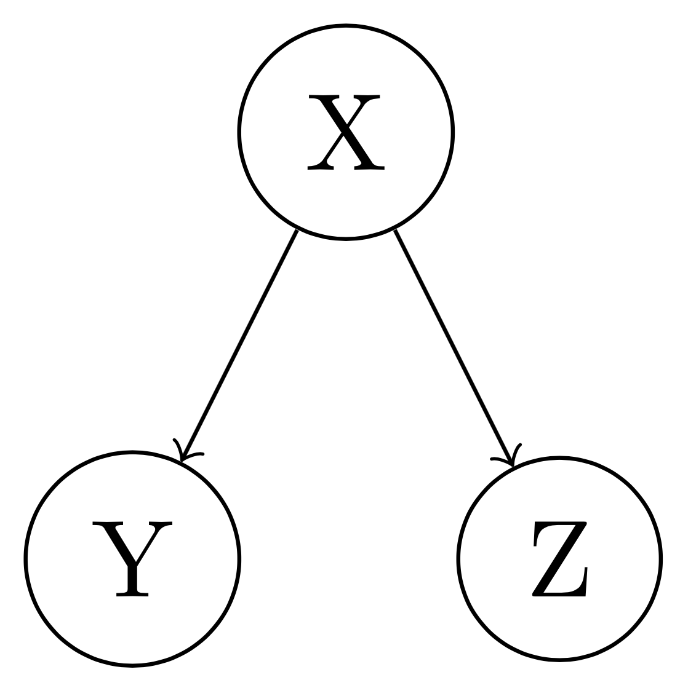
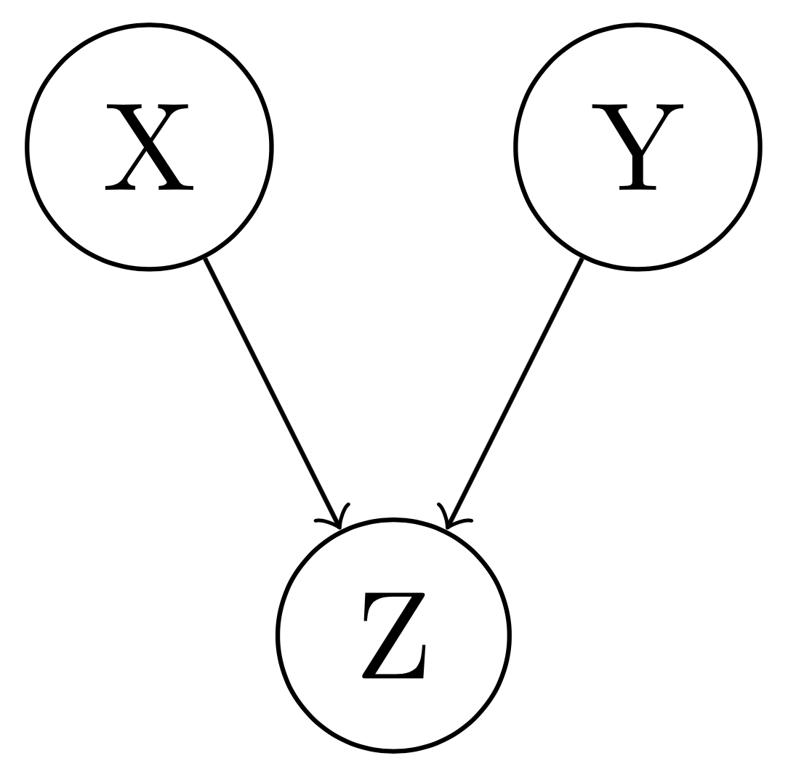

# Graphical Models

Graphical models are a combination of probability theory and graph theory.

**Advantages:**

- Framework for designing and analyzing probabilistic models (causal/diagnostic inference)
- Perform learning tasks (parameter/structure estimation from training set)
- Efficient software implementation (conditional independence properties)

A probabilistic problem can be visualized as a directed acyclic graph where **nodes** are the random variables and **edges** represent the conditional probabilities.

## Factorization

Any joint probability of a directed acyclic graph (i.e. Bayesian network) can be factorized as a product of conditional distributions:

$$
P(X_1, \hdots X_n) = \prod_i P(X_i | pa(X_i))
$$

where $pa(X_i)$ are the parents of $X_i$ on the Bayesian network.

## Independence

$X$ and $Y$ are independent if:

$$
P(X, Y) = P(X) P(Y)
$$

$X$ and $Y$ are conditionally independent given $Z$ if:

$$
\begin{gathered}
P(X, Y | Z) = P(X | Z) P(Y | Z) \\
P(X | Y, Z) = P(X | Z)
\end{gathered}
$$

There are two consequences of conditional independence:

1. Factorization implies that each variable $X_i$ is conditionally independent of all its non-descendants given its parents.
2. Conditional independence tells us when two variables in a BN are conditionally independent given another variable. There are three possible cases: tail-to-tail, head-to-tail, head-to-head.

### Tail-to-Tail Node (Common Cause)

{height=100px}

If $X$ is unobserved:

$$
\begin{split}
P(Y, Z) &= \sum_X P(X, Y, Z) \\
        &= \sum_X P(X) P(Y | X) P(Z | X) \\
        &\neq P(Y) P(Z)
\end{split}
$$

If $X$ is observed:

$$
P(Y, Z | X) = P(Y | X) P(Z | X)
$$

A tail-to-tail node $X$ blocks the path from $Y$ to $Z$ if it is observed i.e. $Y, Z$ become independent.

### Head-to-Tail Node (Causal Effect)

{height=50px}

If $Y$ is unobserved:

$$
\begin{split}
P(X, Z) &= \sum_Y P(X, Y, Z) \\
        &= \sum_Y P(X) P(Y | X) P(Z | Y) \\
        &\neq P(X) P(Z)
\end{split}
$$

If $Y$ is observed:

$$
P(X, Z | Y) = P(X | Y) P(Z | Y)
$$

A head-to-tail node $Y$ blocks the path from $X$ to $Z$ if it is observed i.e. $X, Z$ become independent.

### Head-to-Head Node (Common Effect)

{height=100px}

If $Z$ is unobserved:

$$
\begin{split}
P(X, Y) &= \sum_Z P(X, Y, Z) \\
        &= \sum_Z P(X) P(Y) P(Z | X, Y) \\
        &= P(X) P(Y) \sum_Z P(Z | X, Y) \\
        &= P(X) P(Y)
\end{split}
$$

If $Z$ is observed:

$$
P(X, Y | Z) \neq P(X | Z) P(Y | Z)
$$

A head-to-head node $Z$ unblocks the path from $X$ to $Y$ if it is observed i.e. $X, Y$ become dependent.

## Inference in Bayesian Networks

- Inference = answering a query in a Bayesian network
    - Computation of conditional distributions $P(Q | e)$
    - $Q$ = set of query variables
    - $e$ = evidence (instantiation of a random variable $E$)
- Causal Inference: Reasoning in the direction of the Bayesian network.
- Diagnostic Inference: Reasoning against the direction of the Bayesian network.

The structure of the Bayesian network is used to answer queries efficiently using factorization and the rules of probability.

### Computational Complexity

Consider $n$ binary variables $(X_1, \hdots X_n)$.

- Full unconstrained joint distribution $P(X_1, \hdots X_n)$ requires $O(2^n)$ probabilities. Thus, inference is usually intractable in the general case.
- If we have a Bayesian network, with a maximum of $k$ parents for any node, then we need $O(n \: 2^k)$ probabilities to estimate $P(X_1, \hdots X_n)$.

## d-Separation

Given an arbitrary subset of nodes, $A$, $B$ and $C$, a path from nodes in $A$ to nodes in $B$ is blocked (d-separated) by nodes in $C$ if one of the following conditions is satisfied:

1. The directions of edges meet head-to-tail and the node is in $C$.
2. The directions of edges meet tail-to-tail and the node is in $C$.
3. The directions of edges meet head-to-head and neither that node or any of its descendants is in $C$.

If all paths are blocked, $A$ and $B$ are d-separated (i.e. conditionally independent) given $C$.
