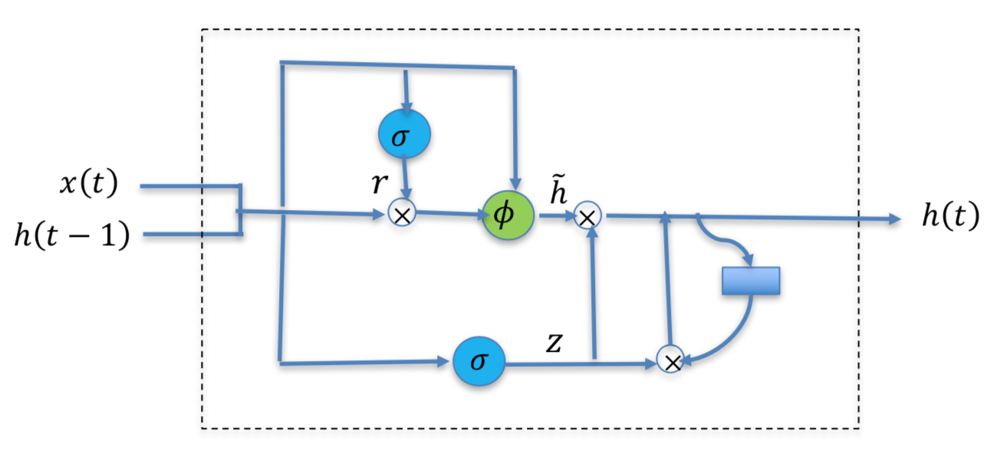
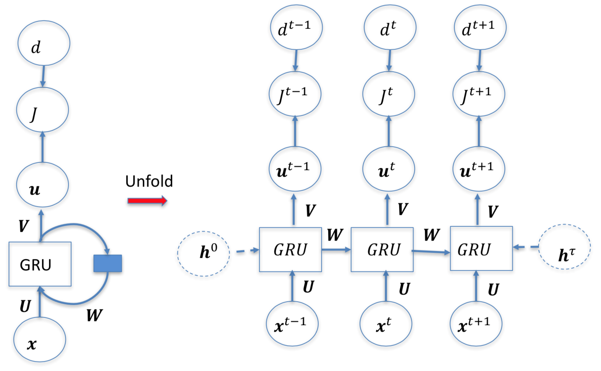

# Gated RNNs

{height=100px}

The memory cell of a RNN is characterized by:

$$
\boldsymbol{h}(t) = \phi(\boldsymbol{U}^T \boldsymbol{x}(t) + \boldsymbol{W}^T \boldsymbol{h}(t - 1) + \boldsymbol{b})
$$

where $\phi$ is the tanh activation function and the RNN cell is referred to as a tanh unit. RNNs built with simple tanh units are known as vanilla RNNs.

## Vanishing & Exploding Gradients

Though RNNs have been proven to solve sequential problems, it is difficult to train them to learn long-term dynamics.

During gradient backpropagation, the gradient can end up being multiplied a large number of times (as many as the number of time steps) by the weight matrix associated with the connections between the neurons of the recurrent hidden layer. Note that each time the activations are forward propagated in time, the activations are multiplied by $\boldsymbol{W}$ and each time the gradients are backpropagated, the gradients are multiplied by $\boldsymbol{W}^T$).

If the weights in this matrix are small, it can lead to a situation called *vanishing gradients* where the gradient signal gets so small that learning either becomes very slow or stops working altogether.

Conversely, if the weights in this matrix are large, it can lead to a situation where the gradient signal is so large that it can cause learning to diverge. This is often referred to as *exploding gradients*.

Vanishing and exploding gradients in gradient backpropagation learning make it difficult for RNNs to learn long-term dependencies.

## Long Short-Term Memory Unit

LSTMs provide a solution to the vanishing & exploding gradient problem by incorporating memory units that allow the network to learn when to forget previous hidden states and when to update hidden states given new information.

LSTMs introduce a gated cell where the information flow can be controlled. They have an internal recurrence (a self-loop) in addition to the outer recurrence of the RNN. The self-loop inside the cell is able to produce paths where the gradient can flow for a long duration. The weights on this self-loop are conditioned on the context rather than being fixed.

By making the weight of the self-loop gated, the time scale of integration can be changed dynamically. In this way, LSTMs help preserve error terms that can be propagated through many layers and time steps.

The gates serve to modulate the interactions between the memory cell and its environment. The self-recurrent connection has a weight of 1.0 and ensures that, barring any outside interference, the state of a memory cell can remain constant from one time step to another.

The input gate can allow the incoming signal to alter the state of the memory cell or block it. On the other hand, the output gate can allow the state of the memory cell to have an effect on other neurons or prevent it. Finally, the forget gate can modulate the memory cell's self-recurrent connection allowing the cell to remember or forget its previous state, as needed.

### Equations

$$
\begin{gathered}
\boldsymbol{i}(t) = \sigma({\boldsymbol{U}_i}^T \boldsymbol{x}(t) + {\boldsymbol{W}_i}^T \boldsymbol{h}(t - 1) + \boldsymbol{b}_i) \\
\boldsymbol{f}(t) = \sigma({\boldsymbol{U}_f}^T \boldsymbol{x}(t) + {\boldsymbol{W}_f}^T \boldsymbol{h}(t - 1) + \boldsymbol{b}_f) \\
\boldsymbol{o}(t) = \sigma({\boldsymbol{U}_o}^T \boldsymbol{x}(t) + {\boldsymbol{W}_o}^T \boldsymbol{h}(t - 1) + \boldsymbol{b}_o) \\
\boldsymbol{\tilde{c}}(t) = \phi({\boldsymbol{U}_c}^T \boldsymbol{x}(t) + {\boldsymbol{W}_c}^T \boldsymbol{h}(t - 1) + \boldsymbol{b}_c)
\end{gathered}
$$

$$
\begin{gathered}
\boldsymbol{c}(t) = \boldsymbol{\tilde{c}}(t) \odot \boldsymbol{i}(t) + \boldsymbol{c}(t - 1) \odot \boldsymbol{f}(t) \\
\boldsymbol{h}(t) = \phi(\boldsymbol{c}(t)) \odot \boldsymbol{o}(t)
\end{gathered}
$$

where $\sigma$ is the sigmoid activation function, $\phi$ is the tanh activation function and $\odot$ is the element-wise product. $\boldsymbol{c}(t)$ is the synaptic input to the cell and $\boldsymbol{\tilde{c}}(t)$ is the candidate cell activation.

## LSTM Recurrent Network

$$
\begin{gathered}
\boldsymbol{W} = \{\boldsymbol{W}_i, \boldsymbol{W}_f, \boldsymbol{W}_o, \boldsymbol{W}_c \} \\
\boldsymbol{U} = \{\boldsymbol{U}_i, \boldsymbol{U}_f, \boldsymbol{U}_o, \boldsymbol{U}_c \} \\
\boldsymbol{b} = \{\boldsymbol{b}_i, \boldsymbol{b}_f, \boldsymbol{b}_o, \boldsymbol{b}_c \}
\end{gathered}
$$

The most important component is the state unit $s_i(t)$ which has an inner self-loop. The self-loop weight is controlled by a forget gate unit $f_i(t)$ (for time step $t$ and cell $i$), which sets this weight to a value between 0 and 1 via a sigmoid unit.

## Gated Recurrent Unit (GRU)

Like LSTM units, gated recurrent units (GRU) attempt to create paths through time that have gradients which either vanish or explode. The main difference with the LSTM is that a single gating unit simultaneously controls the forgetting factor and the decision to update the hidden unit.

### Equations

$$
\begin{gathered}
\boldsymbol{r}(t) = \sigma({\boldsymbol{U}_r}^T \boldsymbol{x}(t) + {\boldsymbol{W}_r}^T \boldsymbol{h}(t - 1) + \boldsymbol{b}_r) \\
\boldsymbol{z}(t) = \sigma({\boldsymbol{U}_z}^T \boldsymbol{x}(t) + {\boldsymbol{W}_z}^T \boldsymbol{h}(t - 1) + \boldsymbol{b}_z) \\
\boldsymbol{\tilde{h}}(t) = \phi({\boldsymbol{U}_h}^T \boldsymbol{x}(t) + {\boldsymbol{W}_h}^T (\boldsymbol{r}(t) \odot \boldsymbol{h}(t - 1)) + \boldsymbol{b}_h) \\
\boldsymbol{h}(t) = (1 - \boldsymbol{z}(t)) \odot \boldsymbol{h}(t - 1) + \boldsymbol{z}(t) \odot \boldsymbol{\tilde{h}}(t)
\end{gathered}
$$

where $\boldsymbol{r}$ is the reset gate and $\boldsymbol{z}$ is the update gate inputs. $\boldsymbol{\tilde{h}}(t)$ is the candidate hidden activation.

## Gated Recurrent Neural Network (GRNN)

$$
\begin{gathered}
\boldsymbol{W} = \{\boldsymbol{W}_r, \boldsymbol{W}_z, \boldsymbol{W}_h \} \\
\boldsymbol{U} = \{\boldsymbol{U}_r, \boldsymbol{U}_z, \boldsymbol{U}_h \} \\
\boldsymbol{b} = \{\boldsymbol{b}_r, \boldsymbol{b}_z, \boldsymbol{b}_h \}
\end{gathered}
$$

## Deep LSTM & Deep GRUs

